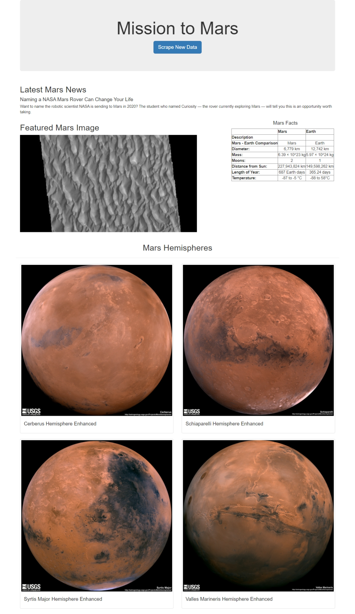
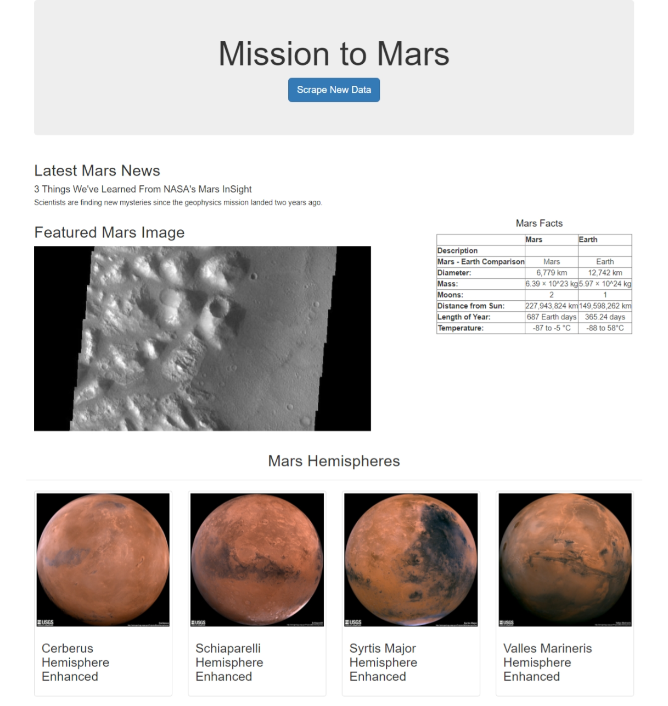

# Mission-to-Mars

## Project Overview

In this project we are performing web scraping from active **Nasa’s** websites in order to retrieve information about Nasa’s latest article, featured picture, Mars facts and images of Mars Hemispheres. All retrieved data are put together in a single web application to showcase the gathered information.

## Resources 

Data Source:
- https://mars.nasa.gov/news/
- https://redplanetscience.com/
- https://spaceimages-mars.com
- https://astrogeology.usgs.gov/search/results?q=hemisphere+enhanced&k1=target&v1=Mars

Environment: 
- Python 3.7

Dependencies: 
- Beautiful Soup and Splinter 
- **Chrome Developer Tool** to identify HTML and CSS components.
- **Beautiful Soup** (extracts data) and **Splinter** (automates web browsers) to automate the scrape [jupyter notebook](Mission_to_Mars_Challenge.ipynb).

Languages: 
- HTML, CSS, Bootstrap 3 and Python
- **Python** to write the script [scraping.py](scraping.py).
- **HTML**, **CSS** and **Bootstrap 3** to customize web application [index.html](templates/index.html).

Software: 
- Jupyter Notebook, VS Code, MongoDB, Flask and Chrome
- **MongoDB**, MongoDB is a source-available cross-platform document-oriented database program. Classified as a NoSQL database program, MongoDB uses JSON-like documents with optional schemas.
- **Flask** to render the data and create a web application [app.py](app.py).

## Requirements:
- Scrape Full-Resolution Mars Hemisphere Images and Titles
- Update the Web App with Mars Hemisphere Images and Titles

  

- Add Bootstrap 3 Components
 - Styling the "Scrape New Data" button
 - Customizing the facts table.
 - Adding the hemisphere images as thumbnails.
 

  

